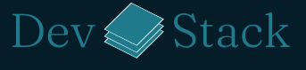
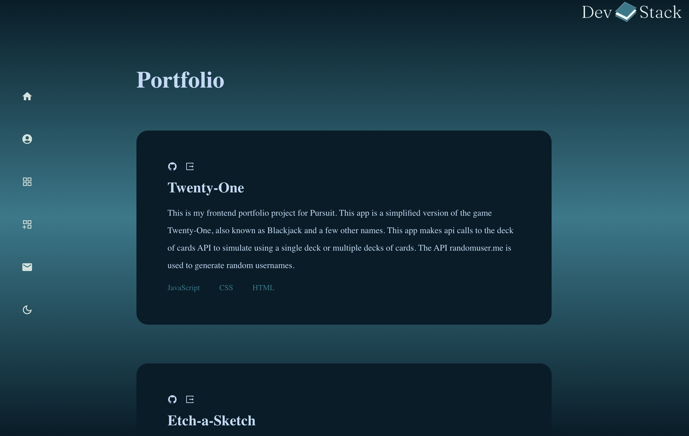

# DevStack

<p align="center">DevStack is a portfolio app that allows users to stay up to date with their projects.</p>


<br/>

# Table of Contents
- [Project Overview](#project-overview)
- [Features](#features)
- [Demo](#demo)
- [Technologies Used](#technologies-used)
- [Getting Started](#getting-started)
- [Installation](#getting-started)
- [Usage](#usage)
- [API Documentation](#api-documentation)
- [Contributing](#contributing)


# Project Overview

[Trello](https://trello.com/b/e1mm8MHA/devstack) board
### Welcome to my portfolio website!
This platform serves as a showcase for developers to present their
projects in an organized and professional manner. Developers can keep their portfolio up to date by editing existing projects or adding new ones as they progress in their coding journey. In future versions, users will be able to customize their own themes for their portfolio.


# Features
- Add a new project
- Delete a project
- Edit a project
- Add project to favorites
- Remove project from favorites
- Link to GitHub, LinkedIn, and other social media platforms
- Share thumbnails of the project
- Responsive Design


# Demo

Here's a link to the [Live demo](https://devstackportfolio.netlify.app/)
# Technologies Used
- JavaScript
- React.js
- Axios
- Tailwind CSS
- PostgreSQL
- Express.js
- Node.js
# Getting Started

## Installation

1. Fork and Clone the repository using the following command:

   ```
   git clone <repository-url>

   ```

2. Navigate to the project directory and install the dependencies using the following command:

   ```
   `cd` into this repository
   npm install

   ```

3. Run `npm start` to start the development server.

4. Open [http://localhost:3000](http://localhost:3000) to view it in your browser.

## Usage

You will need to set up an environment variable to get started. Create a .env file and add the following:
```
    REACT_APP_API_URL=http://localhost:3000 
```

## API Documentation
This project uses an API server created with Express.js.
Here is the link to the backend [Repo](https://github.com/joshuanelsondev/devstack-backend-project). The link to the server is [here](https://devstack-backend.onrender.com).

## Contributing
All feedback and suggestions are welcome! Fork and Clone this repo and submit a pull request with any bugs found any other contributions. Thank you!
